.jpeg?table=block&id=938175f1-165b-470e-9046-2d1f1d52fd78&spaceId=571a24a3-05f9-4ea5-b01f-cba1a3ac070d&width=2000&userId=&cache=v2>)

# 소셜 통합 Feed 웹 서비스

본 서비스는 유저 계정의 해시태그(”#daily”) 를 기반으로 `인스타그램`, `스레드`, `페이스북`, `트위터` 등 복수의 SNS에 게시된 게시물 중 유저의 해시태그가 포함된 게시물들을 하나의 서비스에서 확인할 수 있는 통합 Feed 어플리케이션 입니다.

이를 통해 본 서비스의 고객은 하나의 채널로 유저(”#daily”)의 SNS 노출 게시물 및 통계를 확인할 수 있습니다.
<br/>

## Table of Contents

- [개요](#개요)
- [Skils](#skils)
- [Installation](#Installation)
- [API Reference](#api-reference)
- [프로젝트 진행 및 이슈 관리](#프로젝트-진행-및-이슈-관리)
- [구현과정(설계 및 의도)](<#구현과정(설계-및-의도)>)
- [TIL 및 회고](#til-및-회고)
- [Authors](#authors)
- [References](#references)

<br/>

## 개요

본 서비스는 사용자가 관심을 가지는 특정 해시태그를 중심으로 다양한 SNS 플랫폼에서 게시된 게시물들을 한눈에 볼 수 있게 해주는 통합 피드 어플리케이션입니다.

인스타그램, 페이스북, 스레드, 트위터 등 다양한 SNS에서 특정 해시태그(예: "#daily")가 포함된 게시물들을 모아 사용자에게 제공합니다. 이를 통해 사용자는 여러 SNS를 따로 접속하여 정보를 찾아보는 번거로움 없이, 본 서비스를 통해 원하는 정보를 쉽고 빠르게 얻을 수 있습니다.

또한, 본 서비스는 각 SNS에서의 게시물 노출 통계 정보도 제공하여, 사용자가 자신의 해시태그가 얼마나 많은 노출을 받았는지에 대한 정보를 쉽게 파악할 수 있도록 돕습니다.

이렇게 통합적인 정보 제공을 통해 사용자의 SNS 이용 편의성을 증대시키고, 해시태그 기반의 정보 검색 및 분석을 더욱 효율적으로 수행할 수 있도록 도와주는 것이 본 서비스의 주요 목표입니다.
<br/>

<br/>

## Skils

<div align="center">

언어 및 프레임워크 <br/>    
<br/>
데이터 베이스 <br/><br/>

</div>

<br/>

## Installation

Install FeeDaMoA with npm

```bash
  # Package 설치
  npm install

```

<br/>

## Directory

<details>
<summary> 파일 구조 보기 </summary>

```
src
├─auth
│  ├─decorator
│  ├─dto
│  └─test
├─common
│  └─decorator
├─configs
├─post
│  ├─dto
│  ├─entities
│  ├─pipes
│  ├─test
│  └─types
├─statistics
│  ├─dto
│  ├─enums
│  ├─pipes
│  └─type
└─user
    ├─dto
    ├─entities
    └─test
```

</details>
</br>

## API Reference

Swagger : http://localhost:{port}/swagger#/

<details>

<summary>Get all posts - click</summary>
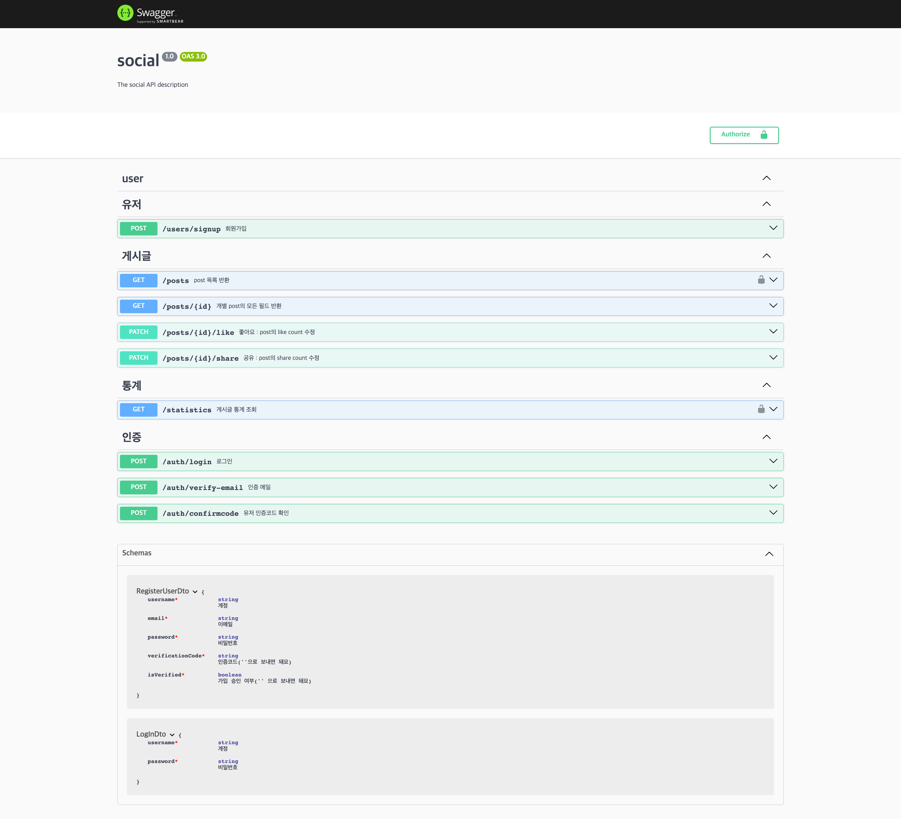
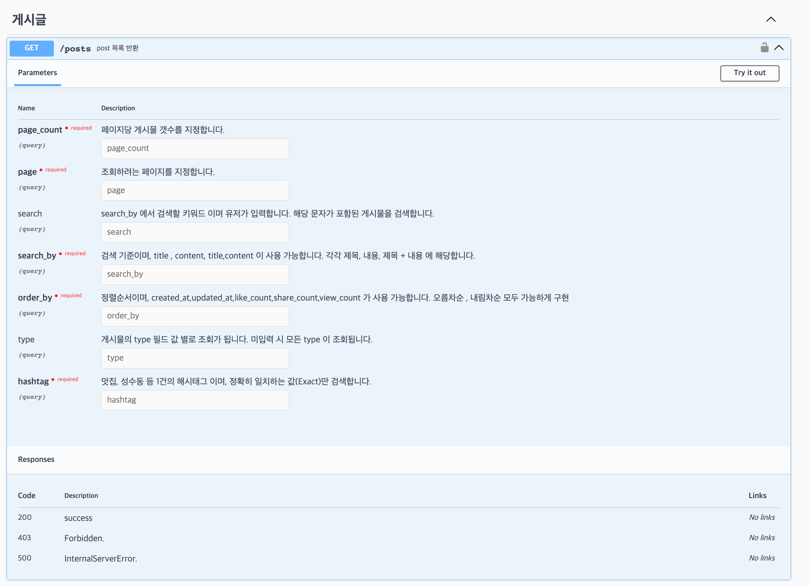
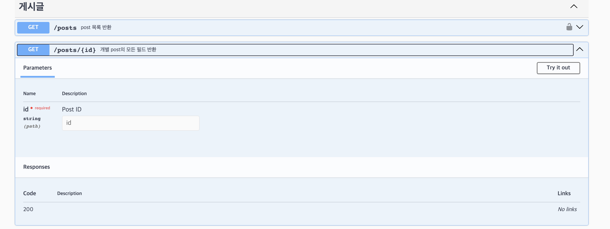
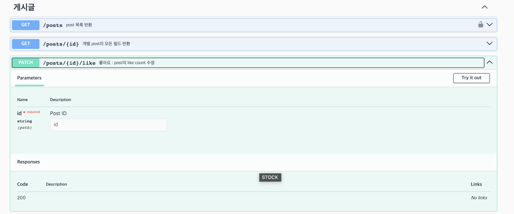
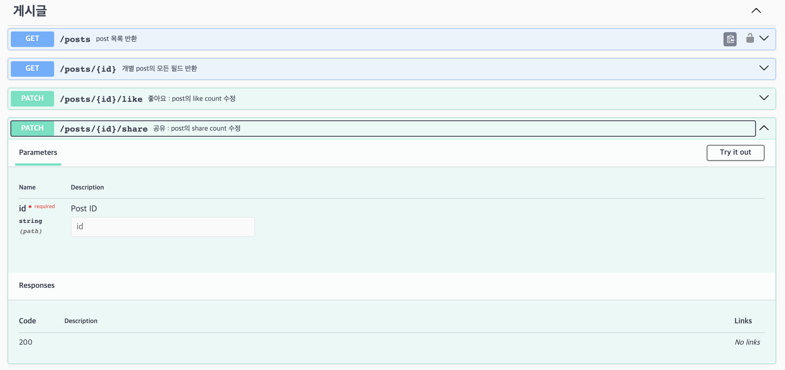
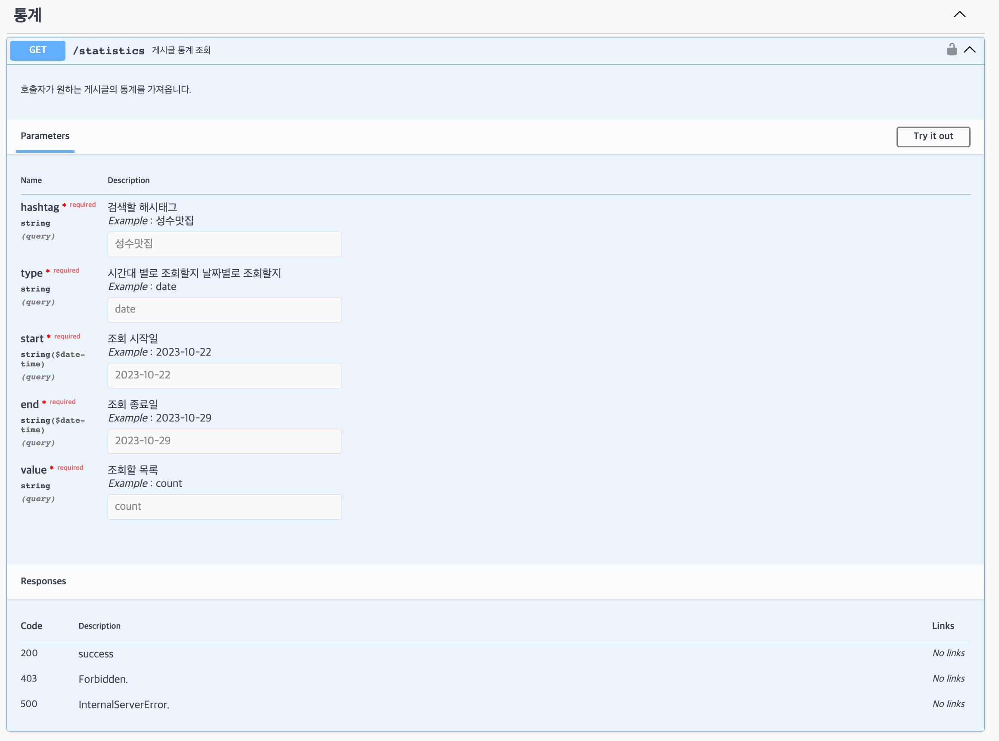
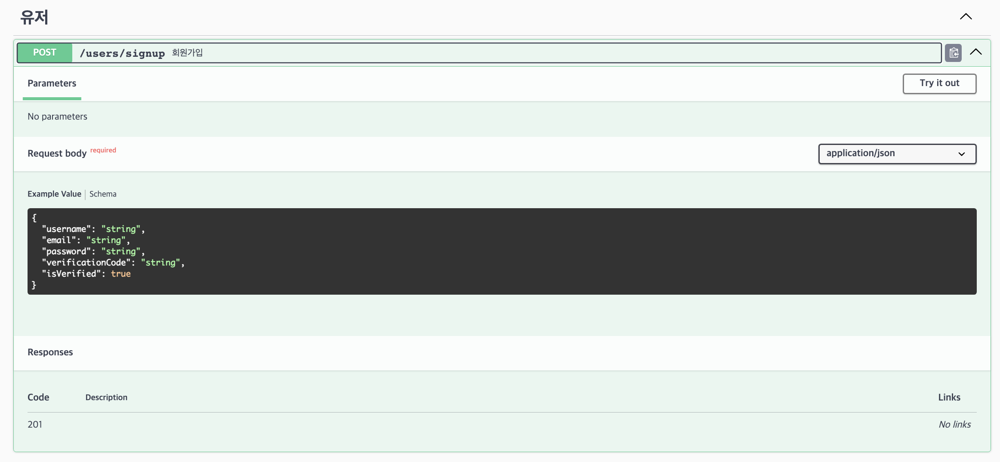
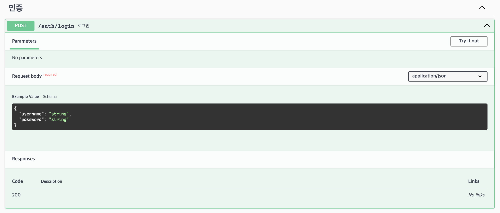
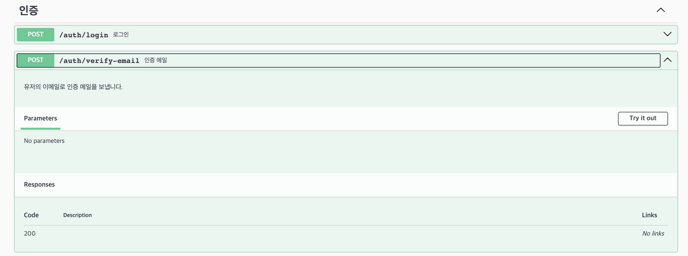
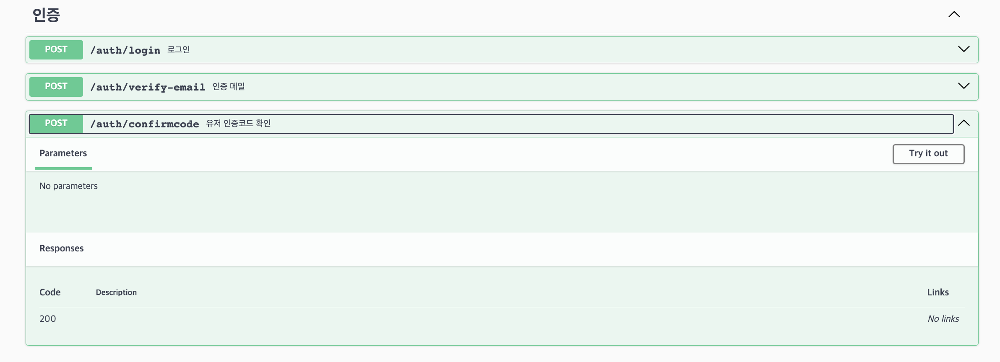

</details>

<br/>

## 프로젝트 진행 및 이슈 관리

[](https://www.notion.so/dev-j/6a83f5bfa7874dc49e4fac30653aaa53?v=25c6ca9163064a8c879dcf124a914f29&pvs=4)

[프로젝트 관리 페이지](https://dev-j.notion.site/FeedDaMoA-fcb079d693404ae28986a9c868aab152?pvs=4)

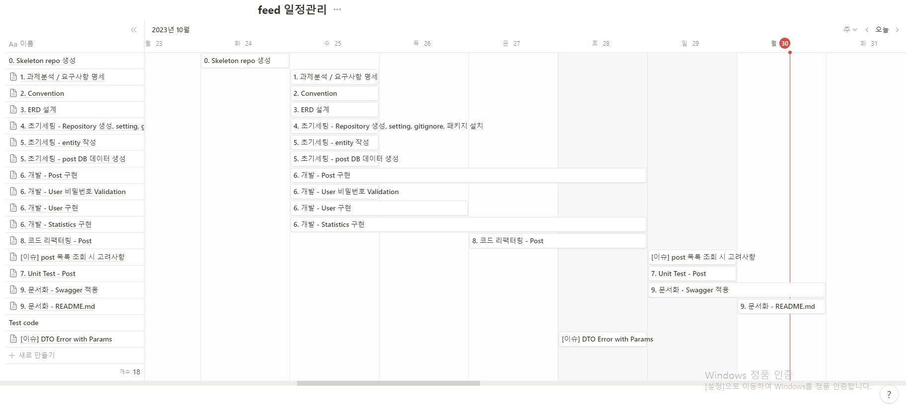

<br/>

## 구현과정(설계 및 의도)

<details>
<summary>Post entity 설계 시 관계 설정 고려- click</summary>

- **태그 관계**
  1. 각 게시물은 여러 개의 해시태그를 포함할 수 있습니다.
  2. 각 해시태그는 여러 게시물에 포함될 수 있습니다.
  3. Post 엔터티와 Tag 엔터티 간의 다대다 관계를 @JoinTable post-tag 테이블을 통해 관리하여 검색과 분류에 용이하도록 설계했습니다.

</details>

<details>
<summary>User 보안 고려 - click</summary>

- **회원가입**

  1. `계정`은 UserEntity에서 username 컬럼에 `unique` 적용
  2. `이메일` 회원가입DTO에 `@IsEmail()`로 이메일 구조 검증
  3. `비밀번호`는 아래와 같은 `제약 조건`을 가지며, `암호화`하여 데이터베이스에 저장
     - 비밀번호는 최소 10자 이상
     - 숫자, 문자, 특수문자 3가지를 포함해야합니다.

- **가입승인**

  1. 회원가입은 누구나 가능하지만 서비스 이용을 못합니다. 로그인 하여 가입 요청을 해야합니다.
  2. 로그인 한 후, 가입 요청을 하면 회원가입할 때 입력한 이메일로 인증 이메일이 발송됩니다.
  3. 이메일에 적힌 랜덤한 6자리의 코드를 바르게 입력하면 UserEntity의 컬럼인 `IsVerified = True`가 되고 JWT토큰에 `IsVerified = True`인 사람들만 사용할 수 있는 조건을 통과 할 수 있습니다.

- **로그인**
  1. 계정, 비밀번호로 로그인 시 JWT토큰이 발급됩니다.
  2. 이후 게시물, 통계 API 요청 Header에 JWT가 항시 포함되며, JWT 유효성을 검증합니다.

</details>

<details>
<summary>Statistics 통계 설계 고려 - click</summary>

- **Post App과 분리**
  1. Post 모듈과 기능적으로 구분하기 위해 관심사 분리해 진행하였습니다.
  2. 실질적으로 DB와 연결하는 Repositury는 Post의 Repositury를 상속받아 Statistics Repository를 구현했습니다.
- **Validator Custom Pipe**
  1. 다양한 경우의 수를 대비해 QueryParams로 받아오는 값들의 유효성 검사를 커스텀해 작성했습니다.
- **Statistics Data**
  1. 통계라는 조금 난해한 쿼리문을 작성하기 위해 RawQuery와 비슷한 QueryBuilder를 사용했습니다.
  2. 통계 데이터 조회 후 날짜별/시간별 count: 0인 데이터 형식을 맞추기 위해 데이터 가공 function의형식을 맞췄습니다.

</details>

<br/>

## TIL 및 회고

### [TIL / 코드리뷰](https://dev-j.notion.site/TIL-8af747d00cbb46778720f3d46f19638c?pvs=4)

- ManyToMany
- NestJS @EntityRepository 대체 방법은?
- Custom Validation Pipe
- 의존성 주입
- NestJS 이메일 인증 구현
- NestJS + axios
- QueryBuilder
- 통계 데이터 가공하기
- Whitelist, dto

<br/>

## Authors

<div align="center">

</br>

 </br>
<a href="https://github.com/keeepmin94">유지민</a> <a href="https://github.com/enxxi">이은석</a> <br/>
<a href="https://github.com/J-A-Y2">정재훈</a> <a href="https://github.com/wonn23">허창원</a>

</div>
<br/>

## References

- [Awesome Readme Templates](https://awesomeopensource.com/project/elangosundar/awesome-README-templates)
- [Awesome README](https://github.com/matiassingers/awesome-readme)
- [How to write a Good readme](https://bulldogjob.com/news/449-how-to-write-a-good-readme-for-your-github-project)
